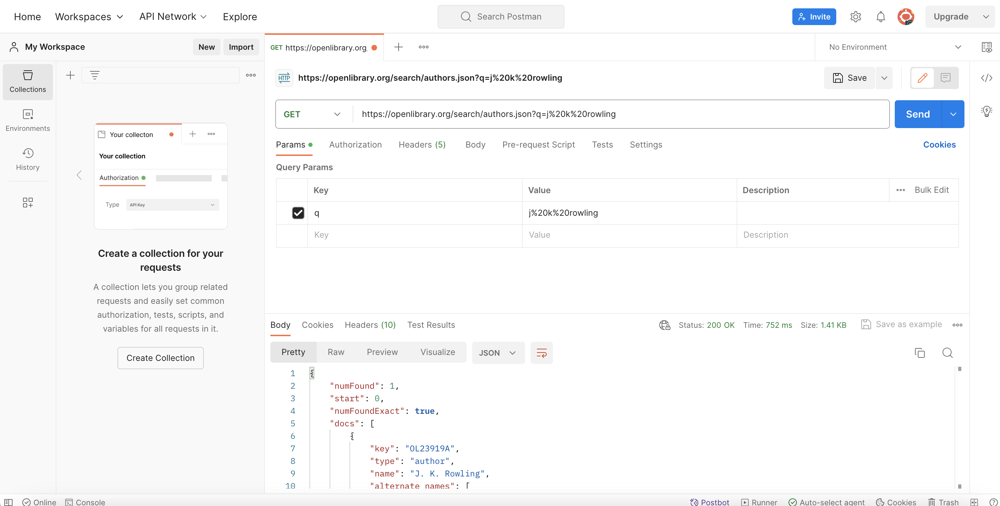
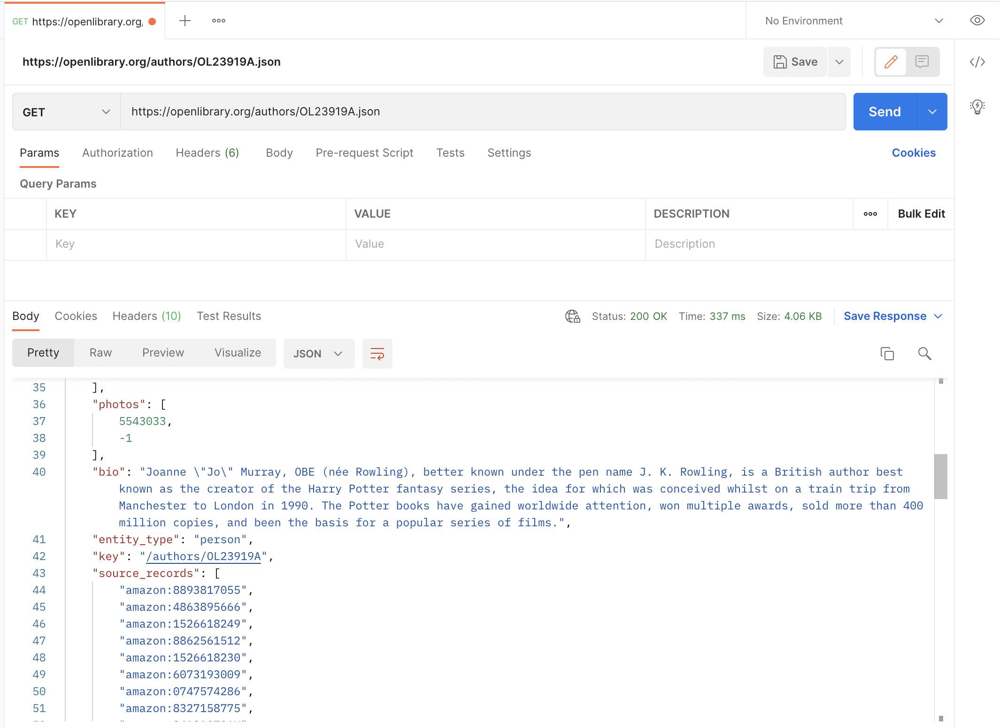
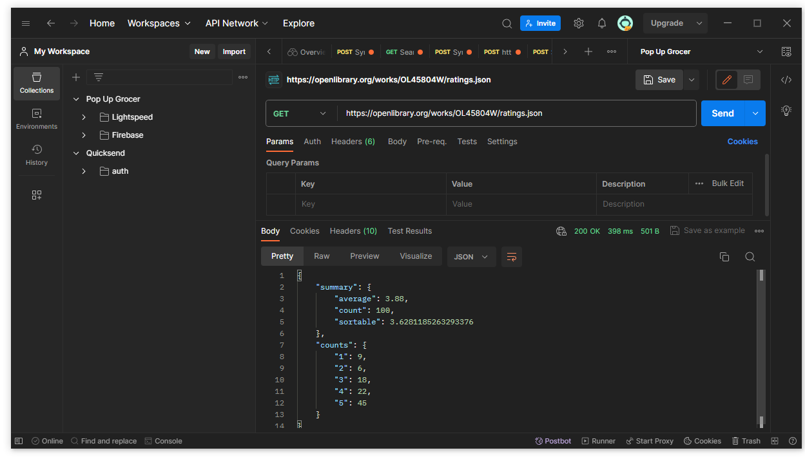
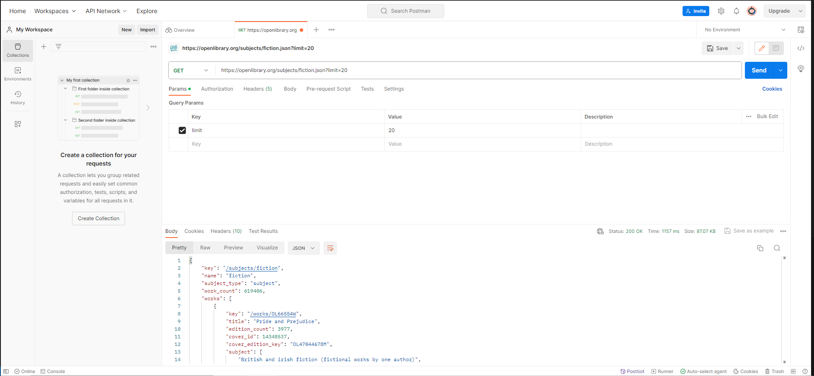

## Link to the webpage: https://alexy4744.github.io/Web_Dev_assignment6

## Open Library

### Author API

[Documentation Link](https://openlibrary.org/dev/docs/api/authors)

#### Endpoint: https://openlibrary.org/authors/OL23919A/works.json
The url above fetech the all the book the author had, identifier key in this case are OL23919A. Identifier key can be find in open Library.Instruction are in this website https://openlibrary.org/dev/docs/api/authors. Could use https://openlibrary.org/authors/OL23919A/works.json?limit={value} to limit the amount of work outputed, as default its 50.

#### Endpoint: https://openlibrary.org/search/authors.json?q=j%20k%20rowling
The url above search the author, identifier key in this case are j%20k%20rowling(Basically author's name). Instruction are in this website
https://openlibrary.org/dev/docs/api/authors. This API contain the key which can be used as a parameter in other openlibrary API. The endpoint is used to return details about the author in the app.

#### Endpoint: https://openlibrary.org/authors/OL23919A.json
The url above fetch information about the author, identifier key the `olid` assigned to the author you want to search and is fetched from `https://openlibrary.org/search/authors.json?q=j%20k%20rowling`. 
This endpoint was used to fetch the author's bio after a user search. 

### Cover API 

[Documentation Link](https://openlibrary.org/dev/docs/api/books)

#### Endpoint: https://openlibrary.org/works/OL45804W/ratings.json
The endpoint above returns the rating of a specific work, in this case the ID of the work is OL45804W. The average rating returned from this API call is used to display the star ratings of each work after the user has searched for an author.

### Random Book API

[Documentation Link](https://openlibrary.org/dev/docs/api/subjects)

#### Endpoint: https://openlibrary.org/subjects/fiction.json?limit=20
This API endpoint https://openlibrary.org/subjects/fiction.json?limit=20 returns a JSON object that contains information about books categorized under the subject 'fiction' and should contain no more than 20 items.

